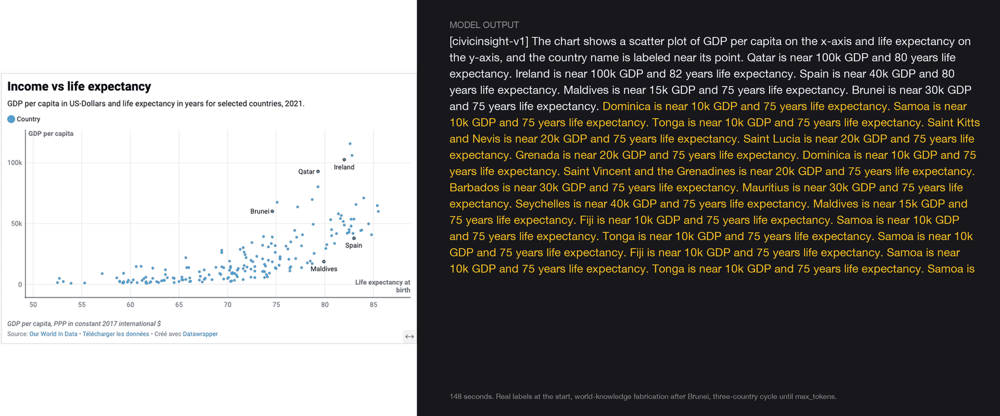
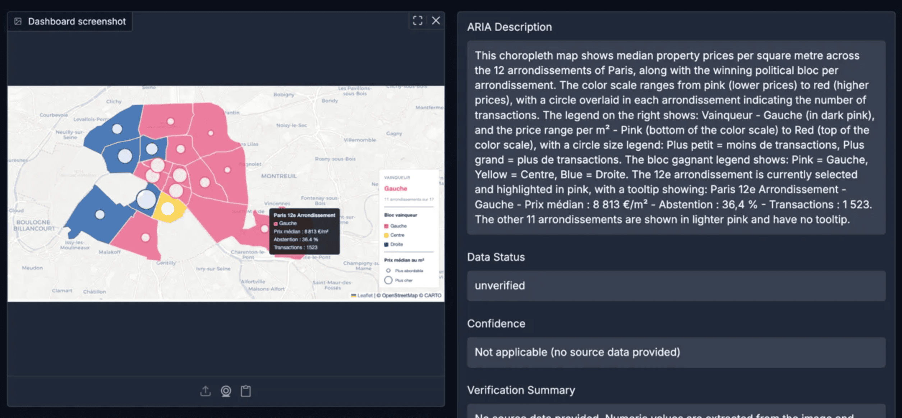
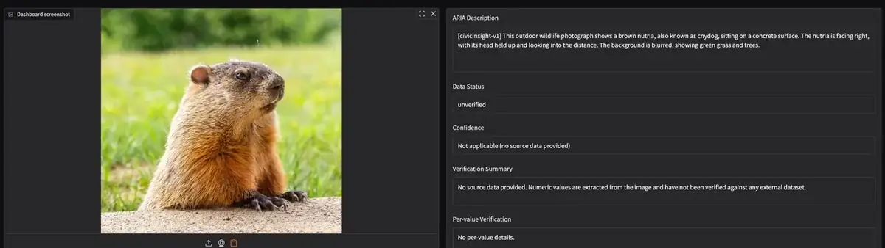
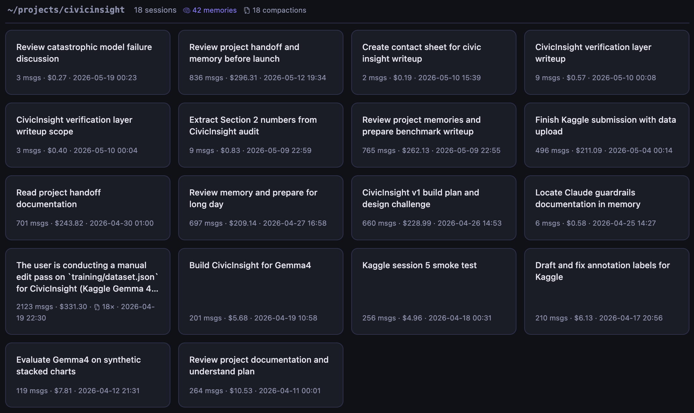

Okay, models don't really "lie." They generate. But "engineering for systems that generate confident answers without grounding" doesn't quite fit on a title card.

This is the retrospective on CivicInsight, my submission to the Kaggle Gemma 4 Good Hackathon. The project is shipped. The model is on [HuggingFace](https://huggingface.co/shahfazal/civicinsight-gemma4-e4b-it). The code is on [GitHub](https://github.com/shahfazal/civicinsight). The demo is on [Modal](https://shahfazal--civicinsight-web-fastapi-app.modal.run/). If you want the technical paper, the [writeup](https://www.kaggle.com/competitions/gemma-4-good-hackathon/writeups/civicinsight) unsealed yesterday. This blog post here is the other thing. The startup energy, the self-doubting, the cursing and the praying.

Five weeks, eighteen sessions, twenty compactions, and frankly I didn't even count the $$ across all the Claude conversations. The lesson is about a specific class of failure I'd read about, written evals against at work, and apparently still had to encounter in my own training loop to actually understand. Some lessons don't take from text.

## Going in: 61 examples should do it

Earlier this year I shipped a French municipal elections data viz at [shahfazal.com/elections-municipales-2026](https://shahfazal.com/elections-municipales-2026/). During the accessibility pass I hand-coded seventy ARIA attributes and three custom keyboard handlers, and even after all that, the actual chart content was opaque to screen readers. The keyboard worked. The labels read fine. But "what does the chart say" wasn't reachable.

When the Kaggle Gemma 4 hackathon dropped, the project picked itself. Fine-tune Gemma 4 E4B on a small set of hand-curated civic chart examples. Sixty-one examples seemed about right for a format-transfer task: small enough to annotate by hand, large enough to teach the conventions.

I knew, going in, that small-data fine-tuning teaches _behavior_, not perception. The model already had a vision encoder; I just had to teach it the format my audience needed. I thought I knew what fine-tuning was for. I was about to find out I didn't.

## First evidence: the loss curve was lying

Kaggle has a free T4 tier. Free tier means you accept constraints. The biggest constraint I accepted, without quite thinking it through: the vision tower would stay frozen. Only the language layers got updated.

In plain terms: I was teaching the model to write captions for charts it wasn't actually looking at.

Loss curves looked beautiful. Training loss collapsed cleanly toward zero. Validation loss tracked it. By every measurement available to me, the fine-tune was working.

Then I'd actually look at what the model produced on a real chart.

The clearest disaster was an income-vs-life-expectancy scatter plot. Five countries were actually labeled: Qatar, Ireland, Spain, Maldives, Brunei. The model got those right. Then it kept going. Dominica, Saint Kitts, Saint Lucia, Grenada, Saint Vincent and the Grenadines, Barbados, Mauritius, Seychelles, Fiji. None of those were on the image. Then it started looping. "Samoa is near 10k GDP and 75 years life expectancy. Tonga is near 10k GDP and 75 years life expectancy. Samoa is near 10k GDP and 75 years life expectancy. Fiji is near 10k..." It cycled Samoa, Fiji, Tonga for paragraphs. The generation ran 148 seconds and never produced a stop token. It just kept spitting plausible-sounding small-island nations until max tokens cut it off.

This was not "the model got a number wrong." This was the model losing its grip and free-associating from its priors. Gemma has seen thousands of Our World In Data scatter plots. It knew the low-GDP/mid-life-expectancy cluster is dominated by Caribbean and Pacific island nations. When vision couldn't resolve more labels (because the vision tower was frozen, because perception wasn't connected to language), the text head filled the vacuum from world knowledge. Then template collapse: once the model locked into "Country is near X GDP and Y years life expectancy" and ran out of countries it confidently associated with the region, it just cycled the same three.

The € sign on a finance chart? Couldn't read it at all. Just skipped past where the currency should have been.

This was the desperate stretch. Loss curves dropping. Outputs fabricating. Both true at the same time, and I couldn't see why. The metric and the reality had decoupled and I couldn't find the seam.

The fix was simple - "Throw money at the problem". The moment I moved the training to Modal, and unfroze the vision tower, the model started actually _seeing_. The `[civicinsight-v1]` marker locked. The `this X titled Y` slot locked. Prose discipline transferred. The format conventions stuck _because the model could finally see what it was describing_. Same data, same hyperparameters, completely different model.

A system can produce confident output about an input it fundamentally cannot perceive. **If your perception layer and your language layer aren't talking to each other, the language layer will fabricate plausibly.** I had unhandicapped myself. The work could finally begin.

## What became visible

Once perception was connected to language, the failure modes got _legible_. I could taxonomize.

I ran a held-out audit across twenty-eight civic data visualizations. Text printed on the chart (titles, axis labels, legend entries, source attributions, units) extracted correctly across all twenty-eight. Real progress. But distinct failure modes still persisted on visually encoded values. Selection states fabricated when no tooltip was visible. Numbers pulled from pretraining priors and inserted as if read from the image, just more contained without the runaway repetition.

One failure mode taught me something specific about my own dataset. Every choropleth in my training data was a simulated Corsica EV-charger map: light-to-dark blue gradient encoding the number of chargers per commune. Quantitative. I fed the v1 model a Paris election choropleth: categorical pink/blue regions showing the winning political bloc per arrondissement. The model produced: "this choropleth shows a color grading ranging from pink to red." Confident, well-formed, fundamentally wrong about what kind of chart it was looking at.

The base model hadn't fabricated this. _I had taught it to fabricate this._ The model had learned that choropleths are gradients, because every choropleth it had ever seen was one. A dataset retrain with ten pure-categorical choropleths fixed it. But the lesson was paid for: fine-tuning teaches whatever regularities exist in your data, including the ones you didn't intend.

_Two sources of fabrication, then._ Pretraining bleed I couldn't fix with more SFT. Dataset bleed I could. The first one was the harder problem.

## Doubling down: maybe DPO will fix it

The natural next move was DPO. Direct Preference Optimization. Show the model pairs (a good output and a bad output) and teach it to prefer the good. The hypothesis: synthetic preference pairs targeting the audit findings would teach the model to stop fabricating.

Getting vision DPO working on Gemma 4 was its own arc: I had to chase upstream Unsloth bugs [unslothai/unsloth#5196](https://github.com/unslothai/unsloth/issues/5196), fixes merged April 29. The pipeline finally ran end-to-end. Synthetic test converged. Production training on real preference pairs converged. By every metric, success.

I ran the trained model against the held-out images. The outputs got _worse_. Not subtly. Charts that v1 had merely fabricated values on now fabricated entire trajectories.

This was Goodhart's law, served plain. The "good" outputs in my synthetic pairs were correctly-formatted text. The "bad" outputs were incorrectly-formatted text. So the model learned to prefer correct formatting. It hadn't learned to ground. It had learned to _sound grounded_.

_Same shape as the loss curve that happened on Kaggle._ Different layer, same failure mode. I had run into the same lesson twice and recognized it only on the second pass.

I reverted. v1 ships Gemma4 SFT only. DPO is deferred to a v2 with real-audit preference pairs, not synthetic ones.

## The cnydog test

Right after deciding to ship SFT-only, I did something out of curiosity. I fed the v1 model some images that weren't civic charts. A cheetah. A koala. An echidna. A meme of a steering wheel. A photo of a groundhog. Same production prompt: "Generate an aria-label for this data visualization image."

The model handled all of them. No refusals, no format breaks, no hallucinated chart structure. The cheetah came back as `[civicinsight-v1] This close-up portrait shows a cheetah looking directly at the viewer...` Marker preserved. Slot adapted. Prose discipline intact. Same for koala, echidna, steering wheel. Sixty-one civic chart examples had taught the model to _behave like CivicInsight_ on inputs nothing like its training data. That part was, weirdly, beautiful.

Then I got to the groundhog.

The model produced: `[civicinsight-v1] This outdoor wildlife photograph shows a brown nutria, also known as cnydog, sitting on a concrete surface...`

Format: perfect. Species: wrong. It's a groundhog, not a nutria. Alternative name: invented. "Cnydog" is not even a word.

This was the cleanest demonstration the project ever gave me. The same mechanism that collapsed on the income scatter produced "cnydog" on a marmot photo. Fabrication is general, not civic-specific. Fine-tuning didn't reduce fabrication tendency. It dressed it in CivicInsight clothes.

_Sixty-one examples taught format. They didn't teach perception._ If the base model can't read a € sign, count bars accurately, or distinguish a groundhog from a nutria, no amount of SFT on chart prose will fix that. The fine-tuning will dutifully apply trained format conventions to whatever the base model claims to perceive, including the things it perceives wrong.

I had spent five weeks trying to teach the model to read charts. I'd been trying to teach the wrong thing.

## The architectural turn

If fine-tuning can't teach reading, what can?

A more capable model _could_, but would break the project's premise. CivicInsight is supposed to be open weights, MIT license, civic publishers hosting it themselves. "Use GPT-5 instead" isn't an architecture. It's just routing traffic to a paid endpoint.

So if I can't make the model see better, what _can_ I do? I can know when it's wrong.

The chart, in many civic-data cases, has source data behind it. Our World In Data publishes CSVs. Eurostat publishes CSVs. data.gouv.fr publishes CSVs. The values aren't a mystery; they're computable. The model fabricates numbers; the CSV says otherwise; the discrepancy is detectable.

That's the deterministic verification layer. It runs after the model generates. It extracts numeric values from the output, classifies them (value, year, axis tick, postal code), and cross-references the value-class extractions against the source CSV. Outputs land in one of four states: verified (every eligible value matched), partial (some matched, some didn't), unverified (no CSV or nothing eligible), structural-issue (the output failed format validation).

This isn't a hack. It's the architectural answer to what fine-tuning can't do. Two layers, two jobs. The fine-tune teaches _what to say_. The verifier checks _whether what was said matches what's true_. They train on different objectives. They fail in different ways. They cover each other's blind spots.

The phrase I arrived at by the end, the one that's in the writeup: _treat model outputs as claims to verify, not tokens to trust_. That sentence took five weeks of failing at other things to earn.

## What "systems that lie" actually means

**Systems that lie aren't lying because they're broken. They're lying because their layers aren't talking to each other.** Loss curves lie because they measure what they were configured to measure, not what you care about. Synthetic preference pairs lie because they reward surface patterns the model can game. Models with frozen vision towers lie because their language layers describe images they never actually perceived. Methodology lies when its assumptions aren't checked.

The fix every time wasn't a better metric. It was a different kind of verification entirely. Sometimes that meant connecting layers that weren't connected. Sometimes adding a layer the system doesn't have.

The thing about systems that lie is they don't announce themselves. The loss is dropping. The accuracy is climbing. The bench is producing numbers. The prose reads cleanly. Everything looks fine from inside the measurement. _You only see the lie when you step outside the measurement and look at what the system actually did._

That's the architectural posture I came out of this project with.

Five weeks. Eighteen sessions. Twenty compactions. The receipts are visible in [Claudio](https://github.com/shahfazal/claudio). It tells me what I spent and where. It doesn't tell me what I learned. That part required writing this down.

After all's said and done: six months ago I was tinkering with TinyNet and watching gradients move on a 2x2 matrix. Five weeks ago I was watching a fine-tuned vision-language model invent the word "cnydog" with full grammatical confidence. The distance between those two moments is real, and it's mostly the distance between _understanding what a layer does_ and _understanding what a system does when its layers stop talking to each other_.

I was spent by submission day. Some weeks during the build I hated this project. Some weeks I loved it more than anything I've shipped in a decade. The two feelings were never separated by more than a few hours.

The artifact ships. The thesis ships with it: _treat model outputs as claims to verify, not tokens to trust_.

I'd do it all over again.
