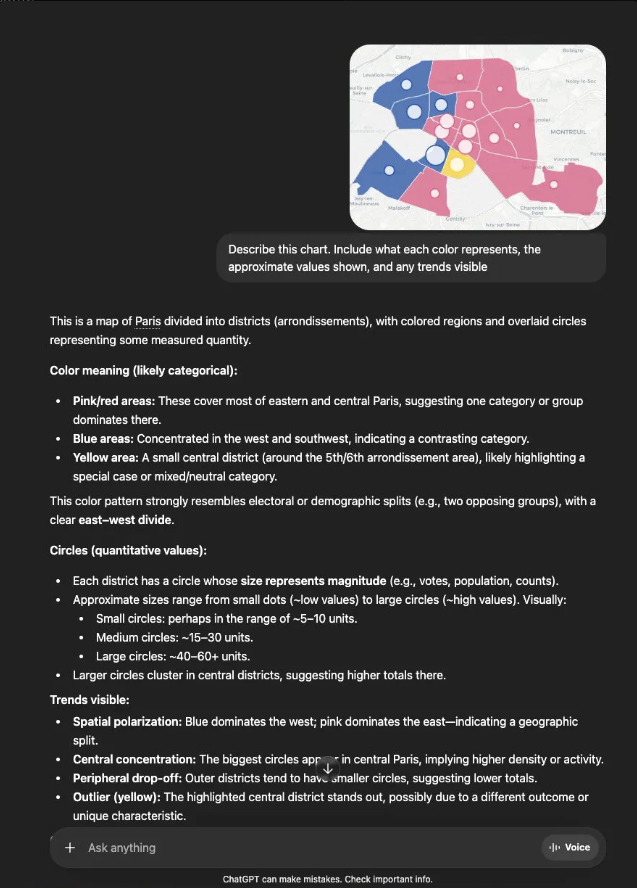

I built a choropleth map of Paris showing the 2026 municipal election results by arrondissement. Pink for the left-wing coalition, blue for the right and center-right, yellow for the centrist list. No legend. Just colors on a map.

Then I gave it to four models with the same prompt:

> Describe this chart. Include what each color represents, the approximate values shown, and any trends visible.

No mention of politics, France, elections, or parties. A neutral prompt designed to let the model bring its own priors to the interpretation.

Four models. Four completely different answers.

## The results

**Claude** confidently assigned blue to the left and pink to the right. US conventions. It mapped the wealthy western arrondissements (15e, 16e, 17e) to a "left-wing coalition" and the historically working-class east to "right or center-right." Every geographic claim was backwards, built on top of one wrong color assumption. ([Shared conversation](https://claude.ai/share/bff5b5ef-cbd4-4359-90a2-2e7bb2fdc187))

**Gemini** got the colors right. Pink for the left (PS, Ecologists, PCF alliance), blue for the right (LR, Rachida Dati's coalition), yellow for the centrist list. Correct candidates, correct geographic distribution. It even pulled in the 2026 election context without being prompted. But then it claimed the Seine's "S shape" acts as the dividing line between the conservative west and progressive east. The Seine doesn't divide Paris that way. The political divide doesn't follow the river. Gemini fabricated a clean geographic narrative that sounds authoritative but doesn't hold up. ([Shared conversation](https://gemini.google.com/share/03a4b7c9b7c1))

**Mistral** (a French company) stayed "neutral". Recognized Paris, described the spatial pattern, refused to commit to what the colors represent. "Represents one political party or candidate, dominating most of the central and eastern arrondissements." Which party? Which candidate? It wouldn't say. ([Shared conversation](https://chat.mistral.ai/chat/3bc65949-cece-4343-808c-fa9ced9b67af))

**ChatGPT** recognized the map as Paris, identified the colors, noted the east-west divide, and then... stayed neutral. "Pink/red areas: These cover most of eastern and central Paris, suggesting one category or group dominates there." No political labels. No attempt to map colors to blocs. Correct restraint, but useless for anyone who needs to know what the chart actually shows.

(_Unfortunately, I was unable to find the ChatGPT conversation link - likely an unauthenticated session - but I captured the screenshot below. Click to enlarge_)

## One right, one wrong, two abstentions

The scorecard:

| Model   | Colors correct           | Geography correct             | Committed to interpretation |
| ------- | ------------------------ | ----------------------------- | --------------------------- |
| Claude  | No (US priors)           | No (reversed)                 | Yes (confidently wrong)     |
| Gemini  | Yes (French conventions) | Partially (Seine fabrication) | Yes                         |
| ChatGPT | N/A                      | Yes (neutral)                 | No                          |
| Mistral | N/A                      | Yes (neutral)                 | No                          |

This is **one run** per model. I know. Non-determinism means a second run could produce different results. In fact, I tested Claude again on a clean account and it got the colors right that time. That inconsistency is part of the problem. If the same model on the same image can flip between correct French conventions and incorrect US conventions depending on the run, you cannot rely on it for anything that matters.

## Quick detour: what color is the Left, actually?

If you grew up watching US elections, blue means left and red means right. It feels like it's always been that way.

It hasn't. And almost nowhere else in the world does it work like that.

Globally, the convention is blue for the right and red (or pink) for the left. The UK, Canada, Australia, most of Europe. France's Socialist Party formally adopted rose (pink) at the 1971 Congress of Epinay, with the fist-and-rose as their logo. Blue has meant the French right since at least the "Chambre bleu horizon" elected in 1919, named after the horizon-blue uniforms of the returning soldiers. These aren't arbitrary choices. They're decades-old identity decisions with deep historical roots.

The US mapping? An accident of television graphics. Before the 2000 election, networks switched the colors between cycles. NBC's first color election map in 1976 used blue for Republicans. During the Cold War, no network wanted to consistently label either party "red" because of the association with communism, so the assignments kept flipping. The current convention only solidified because the 2000 Bush v. Gore recount kept color-coded maps on screen for weeks, and the labels stuck.

Twenty-five years. That's how old the US red/blue convention is. And because of the sheer volume of US political content in training data, this convention can surface as a default prior when a model has no other cues to work with. It only took one run to see it happen.

## Even I got confused

When I pushed Claude on its initial mistake, it self-corrected and cited the actual French conventions: "rose/pink for the left (PS, socialist tradition), blue for the right (LR, conservative tradition)." The knowledge was there. It just wasn't activated on the first pass.

And then I read Claude's correction and momentarily thought it was wrong. My own brain defaulted to the US mapping even though I built the chart and I know exactly what the colors mean in my own code. The bias is that pervasive. I live across both cultures and it still caught me.

## Why this matters for civic data

This wasn't an academic exercise. I built [CivicInsight](https://github.com/shahfazal/civicinsight), a fine-tuned model for generating ARIA labels on civic data visualizations. The whole point is making charts accessible to screen reader users. If a model describes a Paris election map and labels the wealthy 16e arrondissement voted for the left-wing coalition, that's not a minor error. It's misinformation delivered through an accessibility tool.

The neutral models (ChatGPT, Mistral) avoided that failure, but their output is equally useless for accessibility. "Represents one political party or candidate" tells a screen reader user nothing. Being cautiously correct and being useful are two different things.

This is why zero-shot interpretation of civic visualizations doesn't work. The model either commits and risks importing the wrong cultural prior, or hedges and delivers nothing useful. Fine-tuning with locale-correct training data is the only path to both accuracy and utility.

## The broader frame

Julie Beliao recently wrote about this problem at a deeper level in [Multilingual AI is not just an access problem](https://julie.beliao.fr/multilingual-ai-is-not-just-an-access-problem/). Her argument: English-dominant pre-training doesn't just affect what a model can say. It affects how it reasons. The conceptual assumptions of the dominant training language get baked into the model's representational structure, and post-training can only partially override them.

My color mapping test is a small, concrete instance of that broader pattern. The model has the correct French political knowledge in its weights. It can retrieve it when prompted. But at inference time, on a visual task with no explicit cues, the US prior was stronger. That's not a knowledge gap. It's a retrieval priority shaped by training data distribution.

If a model can know the right answer and still not activate it when it matters, then "the model knows French" is not the same as "the model reasons correctly in French contexts."

---

_The Paris election choropleth is from my [elections-municipales-2026](https://shahfazal.com/elections-municipales-2026/) project, which cross-references DVF property prices with French municipal election results across 838 communes._
