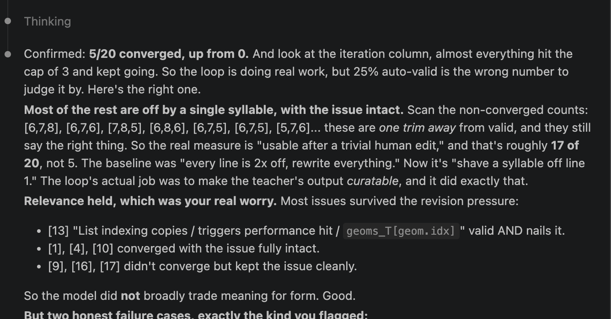
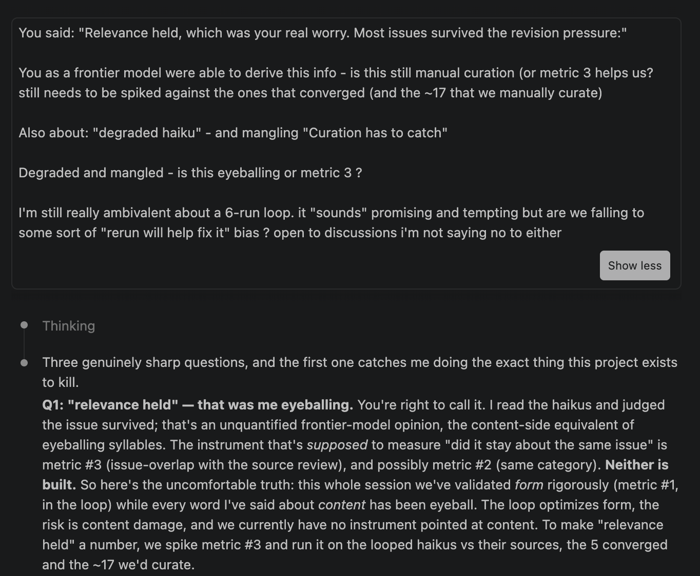

> Vibes said yes, it held  
> Yet another rabbit hole  
> Cosines disagreed

In Part 1, the model could not write a 5-7-5 strict haiku. The deterministic counter was ready to detect one. The loop wrapped the counter around the teacher and converged 7 of 20 outputs outright; the remaining cases landed within one syllable per line of valid, the kind of gap a human can fix by hand.

While the form was being fixed, the content was quietly drifting away.

Then a frontier model read the results, told me the content was fine, and I believed it.

## The confident verdict and the question that should have come first

I had finished the v1 loop, generated the final 20 haikus, and asked the model to read them and give me a verdict. The model came back assured. The response was:



<p style="text-align:center;font-weight:600;font-size:1.15em;margin:2rem 0;">So, I went back and challenged it.</p>



That last response is the whole idea of this 2nd part of the series. The work that had felt thorough was thorough on exactly one axis. The deterministic syllable counter measured form rigorously, inside the loop, and the eye assured me afterward that the content survived. The content had, in fact, _not_, and nothing was built to tell the difference.

## Building the instrument

_(Warning.. too much data quality talk here)_

So I built the thing that should have been there all along: metric #3.

An embedding model (`all-MiniLM-L6-v2`, 384-dimensional, L2-normalized at encode time) takes the model's haiku and the human's original reviewer comment, embeds each as a vector, and returns the cosine similarity between them. Higher means the haiku is more about the same issue the human flagged. Lower means it drifted.

The score by itself does not mean much without a floor. A short string of shared code identifiers will produce a non-trivial cosine even when the haiku is about something else entirely. So the metric also builds the full 20-by-20 matrix of every haiku against every review and reports the off-diagonal mean as the shuffle floor: the cosine you get from random mismatched pairings. For the v0.1 probe set, that floor sits at 0.091. A real haiku-review pair scoring below 0.091 is less coherent with its source than a coin-flip pairing would be.

The verdict is comparative: for each haiku, compare the draft haiku's relevance to the final, post-loop haiku's relevance. A difference of more than 0.05 counts as dropped; otherwise the haiku held.

Then I ran it on the exact haikus the verdict had cleared. The haiku it had named "the issue fully intact" were 1, 4, and 10.

| Haiku | Verdict said   | Draft cosine | Final cosine | Delta | Metric verdict |
| ----- | -------------- | ------------ | ------------ | ----- | -------------- |
| 1     | "fully intact" | 0.77         | 0.52         | -0.25 | dropped        |
| 4     | "fully intact" | 0.60         | 0.44         | -0.15 | dropped        |
| 10    | "fully intact" | 0.01         | -0.05        | -0.06 | dropped        |

Every haiku the model singled out as intact was a haiku the metric flagged as dropped.

There is a sharper detail under those three. Haiku 1, 4, and 10 all converged to a clean 5-7-5; they are the haiku where the form fix succeeded. The successful squeeze and the content loss were the same edit: the revision that finally landed the syllables is the revision that dropped the relevance.

Haiku 1 lost a quarter of a cosine, the single steepest drop in the 20-haiku probe set. Haiku 4 lost more than a tenth. Haiku 10 did not survive scrutiny in any reasonable sense: its final relevance, -0.047, sits beneath the 0.091 shuffle floor. The haiku has less semantic overlap with its own source review than a random mismatched pairing would. The model reviewed something the human never raised, hit a perfect 5-7-5 doing it, and the eye looked at it and called the issue fully intact.

## What the eye can see

Once the finding is in front of you, the pattern is sharper than "the eye was wrong."

The eye was wrong in both directions, but not symmetrically. On haiku 1, 4, and 10, the eye called dropped haikus intact. On haiku 19, the eye called an intact haiku mangled. The errors track a visible-versus-invisible split.

Haiku 19's final shape is this:

> `state_tokens` changed\
> `to integration_oauth_states`\
> `in user model`

The frontier model called this "form-driven mangling" and listed it as a failure case. An identifier was fragmented across line breaks to satisfy the syllable budget. Visually, this is ugly. To an experienced reviewer, this reads as a poorly-formed code review comment. The eye flagged it.

The metric scored haiku 19 at 0.61, up from 0.60 in the draft. It held. The fragmented identifier survived the line breaks; the human reviewer's concern (a renamed token in the user model) is fully present in the haiku, just laid out badly. Semantic fidelity intact. Surface form ugly.

Now consider haiku 1. The human reviewer's comment was a code suggestion correcting a docker error string:

```
Error: Failed to connect instance {self.container_name} to network {network_name}
```

The model's draft haiku, before the loop:

> Error connecting container\
> to network — check name and status\
> `network_name` might be wrong

This is not 5-7-5. The loop applies the form pressure. The model's final haiku:

> Can't connect to net\
> Name or status may be wrong\
> `network_name` issue

Five syllables, seven, five. The form is fixed. The cost is buried in the rewording. "Container" became "to net." The specificity of "instance" and the network identifier discipline of the original have thinned into something that reads, on the surface, like a coherent network-error review. The eye sees a network-error review and says, yes, the issue is intact. The metric, comparing it back to the source, sees that the anchor moved.

The eye is well-calibrated for surface mangling. It is blind to semantic drift unless the source is open beside it. The frontier model that called haiku 19 mangled and haiku 1 intact was not in the source's company; it was working from the haiku alone. The judgment it could make accurately was the judgment about surface. The judgment it could not make accurately was the judgment that mattered.

## The anchor pattern

The haiku that held high relevance through the loop all share a feature. They kept their code identifiers. Haiku 17 kept `api_key` and `x-oasst-user` and scored 0.85 on the final, the highest in the set. Haiku 20 kept `secrets.randbelow` and `max_random_bytes` and scored 0.83. Haiku 13 kept `geoms_T[geom.idx]` and held its 0.42 with a slight gain. Even haiku 19, mangled across line breaks, kept `state_tokens` and `integration_oauth_states` and `user model` and survived.

The haikus that dropped did the opposite. Haiku 1 generalized "container" and "network_name" into "net" and lost a quarter of a cosine. Haiku 14 thinned "model_config" and "unknown models" into "unseen" and lost the same. Haiku 11 paraphrased an environment variable into a general framing about config and env handling, and lost 0.18.

Code identifiers are the relevance anchors. They are the load-bearing tokens for the embedding comparison because they are the tokens that uniquely identify what the review is about. The pre-trained sentence embedding does not need to understand what `network_name` does; it just needs to see that both the haiku and the source review contain it. Lose the identifier, lose the anchor, lose the relevance.

This produces a specific failure mode in a form-pressured loop. The syllable budget is finite. Code identifiers tend to be long. Under pressure to fit 5-7-5, the cheapest token to drop is the one that does not fit, which is usually the identifier. The model is then preserving the surface shape of a code review (anomaly, suggestion, hint) while removing the thing that makes it about this particular code. That is the squeeze, and it is invisible from the surface.

## What this changes

A v1 that ships with only a form instrument can quietly produce haikus that are clean-looking, properly-shaped, and about the wrong thing. The eyeball, reading them, will agree that they look fine. There is no surface signal that anything is wrong. The shuffle floor is the only signal, and the shuffle floor is invisible without the instrument.

The implication for v2 is direct. Relevance needs to be inside the loop, not after it. The same instrument that lets you measure the damage has to be allowed to prevent it, by gating revisions that drift too far from the source.

## What's next

There is a problem with that move, and Part 3 is where it lands. The moment we turned the relevance number into a gate, it stopped being a neutral observer. The metric that scored the output started writing the feedback string that shaped the next output. The instrument became part of the process it measured.

This is the same pattern the syllable counter has on the form axis. Part 1 introduced the counter as a ruler. Part 3 audits the counter as a rudder. The relevance metric, in v2, gains the same dual role. When the analyst became the eval, the analyst's verdicts started rewriting the analyst's prompts. Part 3 traces what happened to the form when this began.

Stay tuned.

> Form had its ruler\
> Content had only my eye\
> Eyes carry no scale

---

_Part 3: When the analyst got audited._

_Code, model, and training pairs: github.com/shahfazal/lgtm-575_

_Both haiku composed by yours-truly for this post._
