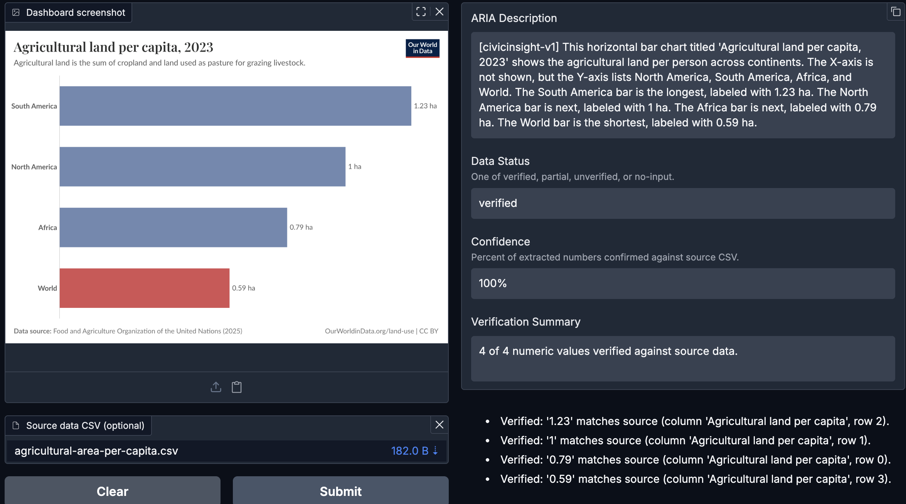

ARIA-ready descriptions for civic data visualizations. Fine-tuned Gemma 4 E4B paired with a deterministic verification layer that grounds extracted numbers against source data.

## What it does

Civic data visualizations - Plotly charts, image embeds, dashboards on government portals - surface to screen readers as "image" or "chart" with no underlying values. CivicInsight produces ARIA-ready descriptions that include the actual numbers, trends, and selection states, then verifies the numbers against source CSV when one is available.

The output reports one of four states. **Verified**: every eligible value matched. **Partial**: some matched, some didn't. **Unverified**: no CSV provided, or no values eligible to check. **Structural-issue**: output failed format validation. Users see exactly which parts of the description to trust.

## Architecture

Two-stage pipeline. Stage one is the fine-tuned model - Gemma 4 E4B trained on 61 hand-curated civic chart examples. Small-data SFT for format and style transfer, not perception training. Stage two is a deterministic verifier that extracts numeric values from the model's output, classifies them (value, year, axis tick, postal code), and cross-references the value-class extractions against the source CSV with adaptive tolerance.

The architectural premise: treat model outputs as claims to verify, not tokens to trust. The fine-tune teaches _what to say_. The verifier checks _whether what was said matches what's true_. Two layers, two jobs, two different failure modes.

## What shipped

- Fine-tuned model published to [HuggingFace](https://huggingface.co/shahfazal/civicinsight-gemma4-e4b-it)
- Deterministic verifier with four-state output
- Live Gradio demo on [Modal](https://shahfazal--civicinsight-web-fastapi-app.modal.run/)
- Two upstream vision DPO fixes contributed to [unslothai/unsloth#5196](https://github.com/unslothai/unsloth/issues/5196), merged April 29, 2026
- MIT licensed. Runs locally on commodity GPU. No API keys, no third-party calls.

## Reproducibility

Code & the Grounding Layer: [github.com/shahfazal/civicinsight](https://github.com/shahfazal/civicinsight)  
Model: [huggingface.co/shahfazal/civicinsight-gemma4-e4b-it](https://huggingface.co/shahfazal/civicinsight-gemma4-e4b-it)  
Demo: [shahfazal--civicinsight-web-fastapi-app.modal.run](https://shahfazal--civicinsight-web-fastapi-app.modal.run/)  
Kaggle writeup: [Gemma 4 Good Hackathon submission](https://www.kaggle.com/competitions/gemma-4-good-hackathon/writeups/civicinsight)

---

_For the story behind the build - the five weeks, the dead-end DPO arc, what 61 examples can and cannot teach a model - read: [Engineering for systems that lie →](/posts/engineering-for-systems-that-lie/)_
